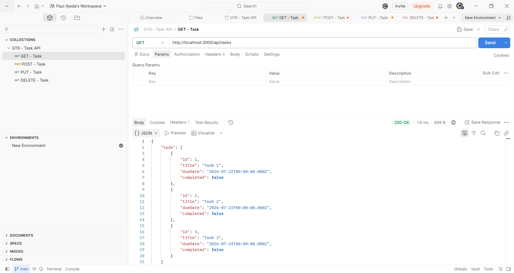
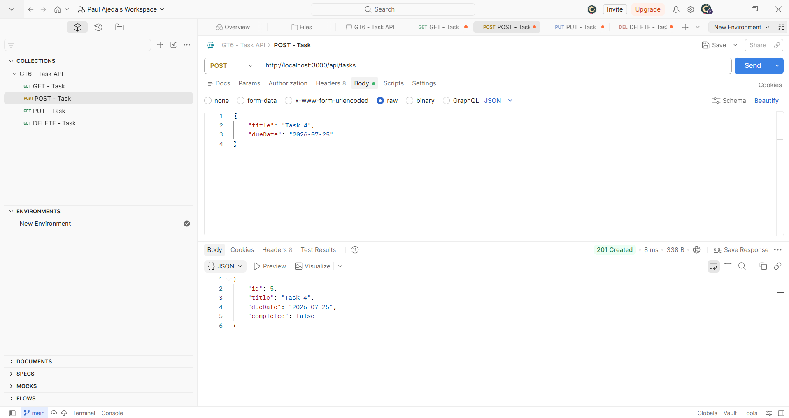
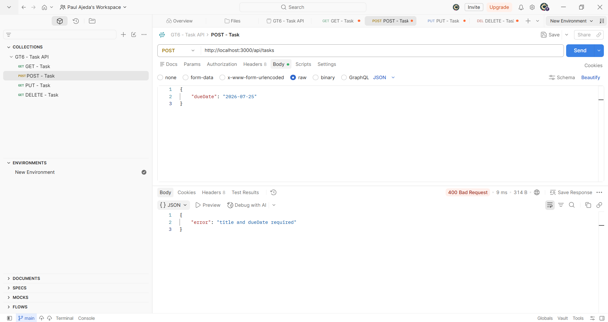
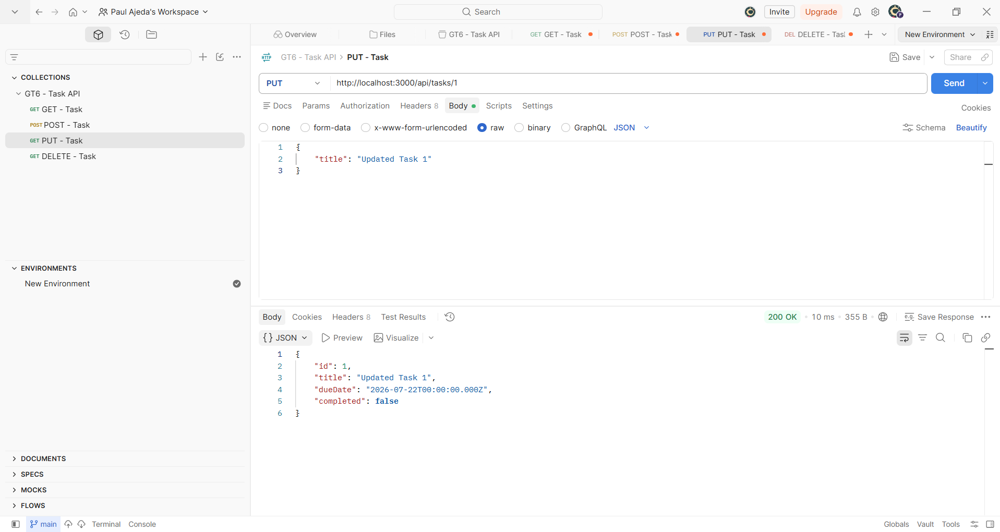
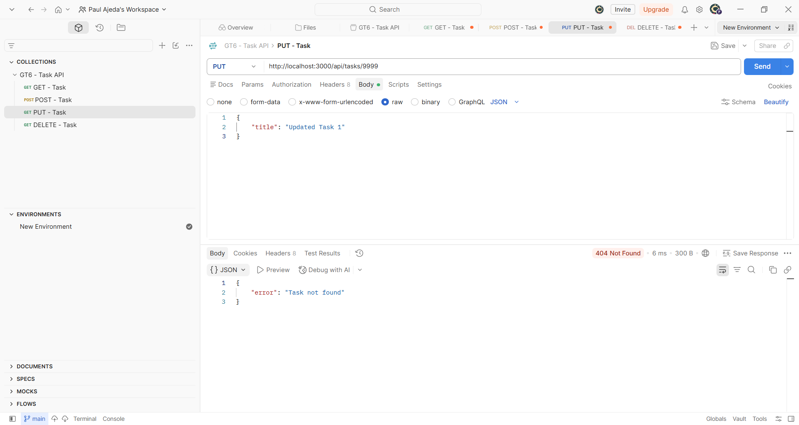
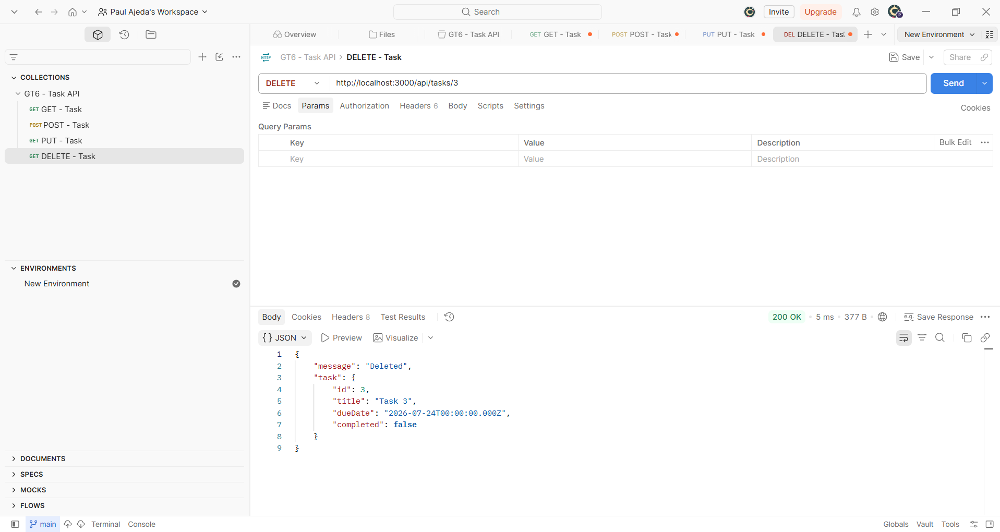
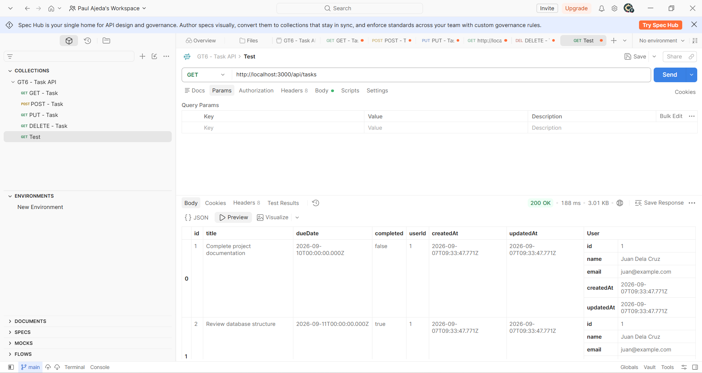
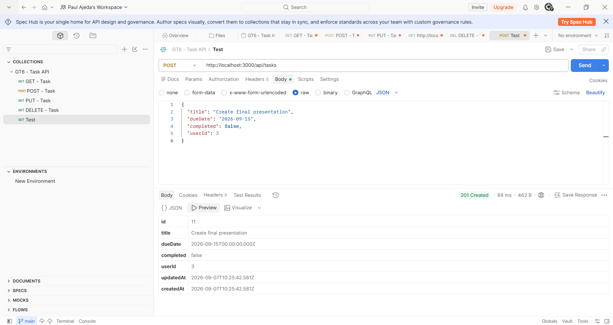
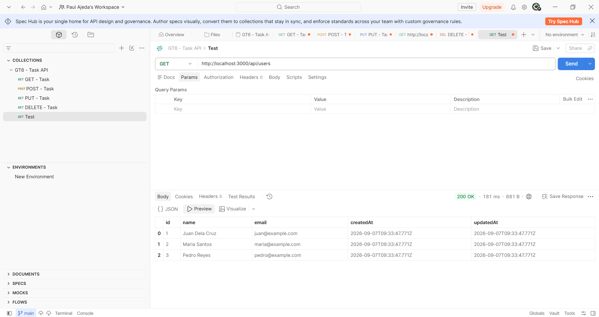

## Author
Paul Geneo Ajeda

# itelect2-project

My IT Elective 2 backend web development project.

## Project Overview

This repository contains the activities and graded tasks for IT Elective 2.

---

## Graded Task 1 (GT1)

### GitHub Repository Setup

* Created and pushed the itelect2-project repository to GitHub.
* Added README.md, .gitignore, and index.html.
* Created at least 3 meaningful commits.
* Made the repository public.
* Submitted the GitHub repository URL through the class portal.

---

## Graded Task 2 (GT2)

### Project Setup

* Created the feature/setup branch.
* Added src/app.js with a console log message.
* Committed and merged the feature branch to main.
* Ran npm init -y and added package.json.
* Created .env and verified that it does not appear on GitHub.

---

## Graded Task 3 (GT3)

### ES6+ Utility Functions

* Added "type": "module" to package.json.
* Created src/utils.js.
* Added formatDate().
* Added validateTask().
* Added mergeTaskUpdate().
* Imported and tested the functions in src/app.js.
* Ran node src/app.js successfully.
* Commit: GT3: Add ES6+ utility functions

---

## Graded Task 4 (GT4)

### Async Functions and Task Validation

* Created src/api.js.
* Added fetchSampleUsers().
* Added fetchSampleUsersPromise().
* Added TaskValidationError in src/utils.js.
* Added createTask().
* Tested the functions in src/app.js.
* Ran node src/app.js successfully.
* Commit: GT4: Add async functions to app.js

---

## Graded Task 5 (GT5)

### Express Server and Routing

* Installed Express.
* Created server.js.
* Created routes/index.js.
* Added GET /api/tasks.
* Added GET /api/tasks/:id.
* Added GET /api/users.
* Mounted the router using /api.
* Tested the endpoints using the browser or Postman.
* Commit: GT5: Add Express server with routing

---

## Graded Task 6 (GT6)

### CRUD REST API

* Installed CORS and Morgan.
* Added CORS, Morgan, and JSON middleware.
* Added POST /api/tasks.
* Added PUT /api/tasks/:id.
* Added DELETE /api/tasks/:id.
* Added error-handling middleware.
* Used the required status codes: 200, 201, 400, 404, and 500.
* Tested the API endpoints using Postman.
* Commit: GT6: Complete CRUD REST API with middleware

---

## API Testing

#### GET Tasks

GET /api/tasks successfully returns the list of tasks with status code 200.

---

#### POST Tasks

POST with a valid body returns 201.

POST with a missing title returns 400.

---

#### PUT Tasks

PUT with an existing ID returns 200.

PUT with ID 9999 returns 404.

---

#### DELETE Tasks

DELETE with an existing ID returns 200.

DELETE on the same ID returns 404.

## Graded Task 7 (GT7)

### PostgreSQL and Sequelize Setup

* Installed Sequelize and PostgreSQL packages.
* Created the itelect2_dev atabase.
* Initialized Sequelize.
* Created User and Task models.
* Created and ran database migrations.
* Configured PostgreSQL using .env and config/config.cjs.
* Verified the database connection and tables.
* Commit: GT7: Connect PostgreSQL via Sequelize

---

## Graded Task 8 (GT8)

### PostgreSQL CRUD Integration

* Updated Sequelize models and relationships.
* Added a database seeder for Users and Tasks.
* Replaced in-memory task data with PostgreSQL.
* Updated CRUD API endpoints to use Sequelize.
* Added User data to task responses.
* Tested the API endpoints using Postman.
* Commit: GT8: Replace in-memory data with PostgreSQL

### GT8 API Testing

#### GET Tasks

GET /api/tasks returns all tasks with their associated users.

#### POST Task

POST /api/tasks creates a new task and returns a generated ID with status code 201.

#### GET Users

GET /api/users returns the users from PostgreSQL with status code 200.

#### Other API Tests

* GET /api/tasks/:id successfully retrieves a specific task.
* PUT /api/tasks/:id successfully updates an existing task.
* DELETE /api/tasks/:id successfully deletes a task.
* GET /api/tasks/:id returns 404 after the task is deleted.

---

